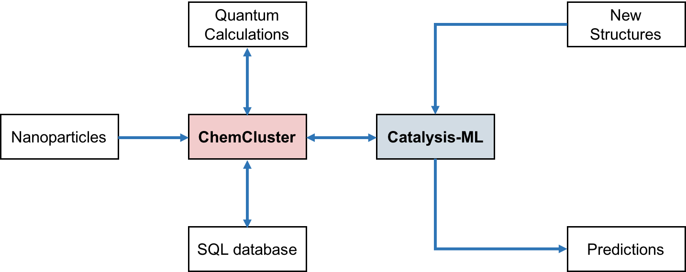

# ChemCluster

---

ChemCluster is a data management system to perform extraction, transformation and loading (ETL) of surface sites from nanoparticles to nanoclusters. It can be coupled to our machine learning module [**Catalysis-ML**](https://github.com/yufenghuang/catalysis-ml) to make predictions about chemical reactions on surfaces. The set up is shown as follows:

---

---
The main functions of ChemCluster are:
1. Extract surface sites from nanoparticles,
2. Transform and prepare clusters for quantum mechanical (QM) calculations, 
3. Read data from textfile generated from QM calcuations, 
4. Communicate with Catalysis-ML to load data for machine learning. 
